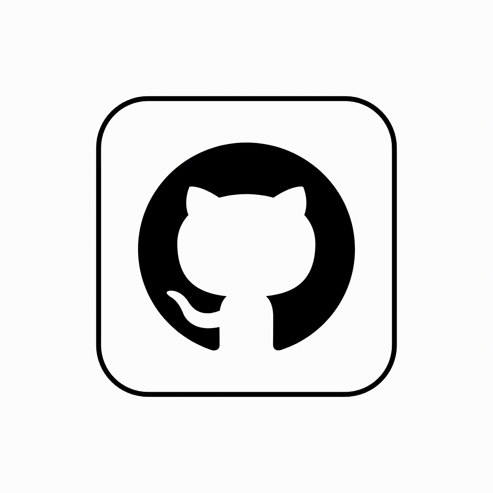
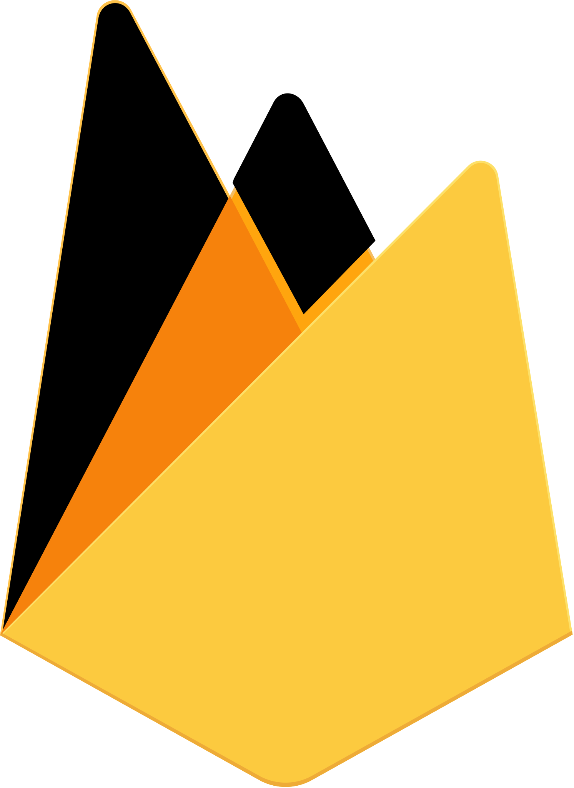
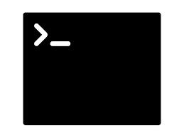

# Hi there 👋  <!-- aka [codeSTACKr][youtube]-->

<h1 align="center">   I'm <a href="https://github.com/the-iconic-rihan">Rihan Bagwan</a>👨‍💻</h1>

<!-- 

 -->

## I'm a Programmer, Student, Reader, and Trekker

<!-- - 🔭 Check out my blogs on Medium: [Medium][course]! -->
- 🌱 I’m currently learning <b>M.E.R.N.<b/>
- 👯 I’m looking to collaborate with other other developers, open source community and projects.
- 🥅 2022 Goals: Learn more about web3.0, Data Structure and Algorithms.
- ⚡ Fun fact: I love to watch web series and play e-games.
<!-- - 😻 Check out the NFT collection I created: [CodeCats](https://opensea.io/collection/codecats?search[sortAscending]=true&search[sortBy]=PRICE&search[toggles][0]=BUY_NOW) -->

### Connect with me

<!--  -->
 
  &nbsp;&nbsp;
 
  &nbsp;&nbsp;
 
 &nbsp;&nbsp;
 
 &nbsp;&nbsp;
 
  &nbsp;&nbsp;

### Tools

[]
[]
[]
[]
[]
[]
[]
[]

 

### Languages

[]
[]
[]
[]
[]
[]
[]
[]
[]
[]
[]
[]
[]
[]
[]
 
 

---

### 📺 Latest YouTube Videos

➡️ [more videos...](https://youtube.com/codestackr)

---

### 📕 Latest Blog Posts

➡️ [more blog posts...](https://codestackr.com)

---

  
:zap: Recent GitHub Activity

  
<!--START_SECTION:activity-->
1. ❌ Closed PR [#5](https://github.com/codeSTACKr/nft-landing-page/pull/5) in [codeSTACKr/nft-landing-page](https://github.com/codeSTACKr/nft-landing-page)
2. 💪 Opened PR [#1580](https://github.com/anuraghazra/github-readme-stats/pull/1580) in [anuraghazra/github-readme-stats](https://github.com/anuraghazra/github-readme-stats)
3. 🗣 Commented on [#1572](https://github.com/anuraghazra/github-readme-stats/issues/1572) in [anuraghazra/github-readme-stats](https://github.com/anuraghazra/github-readme-stats)
4. 🎉 Merged PR [#1](https://github.com/mongodb-developer/mongodb-ecommerce/pull/1) in [mongodb-developer/mongodb-ecommerce](https://github.com/mongodb-developer/mongodb-ecommerce)
5. 💪 Opened PR [#1](https://github.com/mongodb-developer/mongodb-ecommerce/pull/1) in [mongodb-developer/mongodb-ecommerce](https://github.com/mongodb-developer/mongodb-ecommerce)
<!--END_SECTION:activity-->

  
:zap: GitHub Stats

  

